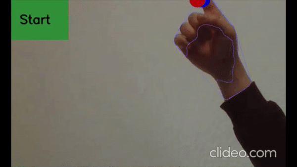
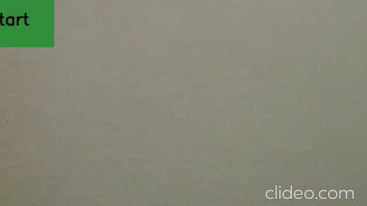
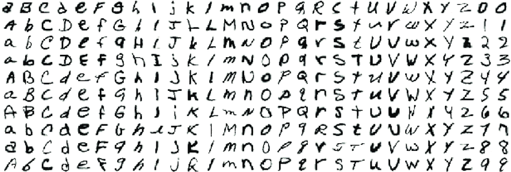

# corona_communication

Alphabet recognition using real time finger gesturing. This way, it is possible to communicate purely with finger gestures, including to machines to prevent contacts with button on public places.

### Example (letter c)

### Example (number 1)

### System

1. Raspberry Pi 4 Model B
2. Raspberry Pi NoIR Camera V2 

### Dataset of Choice

[_EMNIST: an extension of MNIST to handwritten letters__](http://arxiv.org/abs/1702.05373)
 
Cohen, G., Afshar, S., Tapson, J., & van Schaik, A. (2017).
 

